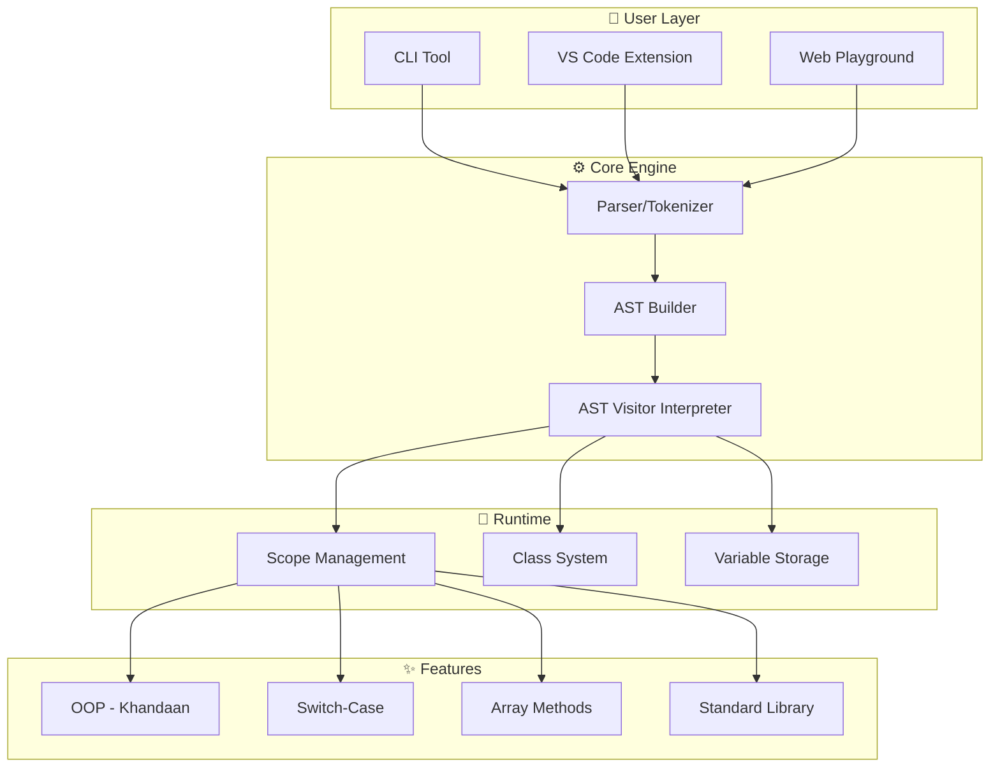

<div align="center">

<!-- Animated Header -->


<!-- Animated Badges -->
<p>
  
  
  
  
</p>

<p>
  
  
  
</p>

<!-- Typing Animation -->
<a href="#">
  
</a>

<!-- Demo Screenshot -->
<br><br>


</div>

---

<div align="center">

## ⚡ Why Dad Lang is Different

</div>

<table align="center">
<tr>
<td align="center" width="25%">

<br><b>🎯 Full OOP</b>
<br><sub>Classes, Inheritance, Constructors</sub>
</td>
<td align="center" width="25%">

<br><b>🧠 Switch-Case</b>
<br><sub>Rishtedaar system for control flow</sub>
</td>
<td align="center" width="25%">

<br><b>📝 VS Code Support</b>
<br><sub>Full syntax highlighting</sub>
</td>
<td align="center" width="25%">

<br><b>🌐 Web Playground</b>
<br><sub>Run code in browser!</sub>
</td>
</tr>
</table>

---

## 🌟 Features That Make This Language Unique

<div align="center">

```
╔══════════════════════════════════════════════════════════════════════════════╗
║                                                                              ║
║   📝 WRITE CODE    →    🔧 PARSER    →    🧠 INTERPRETER    →    ✨ OUTPUT   ║
║   (Dad Syntax)        (TypeScript)       (AST Visitor)         (Console)    ║
║                                                                              ║
║                              ↓↓↓                                             ║
║                                                                              ║
║   🎯 UNIQUE FEATURES                                                         ║
║   ┌─────────────┬─────────────┬─────────────┬─────────────┐                  ║
║   │   Classes   │ Inheritance │ Switch-Case │   Arrays    │                  ║
║   │  khandaan   │ka_khoon_hai │rishtedaar   │  Hisaab     │                  ║
║   └─────────────┴─────────────┴─────────────┴─────────────┘                  ║
║                                                                              ║
║   💪 BUILT WITH: TypeScript + Node.js + React                               ║
║                                                                              ║
╚══════════════════════════════════════════════════════════════════════════════╝
```

</div>

### 🎯 Core Language Features

| Feature | Keyword | Example Usage | Status |
|---------|---------|---------------|--------|
| 🏁 **Program Start** | `hi bhai` | Program entry point | ✅ |
| 🏁 **Program End** | `bye bhai` | Program exit point | ✅ |
| 📢 **Print** | `bol bhai` | `bol bhai "Hello";` | ✅ |
| 💾 **Variable** | `ye sambhal` | `ye sambhal x = 10;` | ✅ |
| 🔒 **Constant** | `ye pakka` | `ye pakka PI = 3.14;` | ✅ |
| 🔀 **If-Else** | `agar bhai` | Conditional logic | ✅ |
| ♻️ **Loops** | `jab tak bhai` | While loops | ✅ |
| 🏛️ **Classes** | `khandaan` | OOP support | ✅ |
| 👨‍👦 **Inheritance** | `ka_khoon_hai` | Class extension | ✅ |
| 🆕 **New Object** | `avtaar` | Instantiation | ✅ |
| 👤 **This** | `khud` | Self reference | ✅ |
| 🏗️ **Constructor** | `sanskar` | Class constructor | ✅ |
| 🔀 **Switch** | `rishtedaar_aaye` | Switch statement | ✅ |
| 📌 **Case** | `muh_dikhai` | Case label | ✅ |
| ⬇️ **Default** | `bache_kuche` | Default case | ✅ |
| 📊 **Arrays** | `[...]` | Data structures | ✅ |

---

## 🚀 Quick Start

<div align="center">


</div>

### 📦 Installation

```bash
# Clone the repository
git clone https://github.com/darkphoenix2208/DAD_LANGUAGE.git
cd DAD_LANGUAGE

# Install dependencies
npm install

# Build all packages
npm run build
```

### 🎮 Run Your First Program

```javascript
hi bhai
    bol bhai "Padhai kar raha hun!";
    
    ye sambhal marks = 95;
    agar bhai marks > 90 {
        bol bhai "Shabash beta!";
    } warna bhai {
        bol bhai "Aur mehnat karo!";
    }
bye bhai
```

**Save as `test.dad` and run:**
```bash
node packages/cli/bin/index.js test.dad
```

<div align="center">

### 🌐 Access Points

| Component | Description | Location |
|-----------|-------------|----------|
| 🖥️ **CLI** | Command-line interpreter | `packages/cli/` |
| 📚 **Parser** | Syntax parser | `packages/parser/` |
| 🧠 **Interpreter** | Runtime engine | `packages/interpreter/` |
| 🎨 **VS Code Extension** | Syntax highlighting | `packages/vscode/` |
| 🌐 **Web Playground** | Browser-based editor | `apps/docs/` |
| 📖 **Examples** | Sample programs | `examples/` |

</div>

---

## 🏗️ System Architecture

<div align="center">



</div>

---

## 💡 Language Examples

### 🎯 Hello World

```javascript
hi bhai
    bol bhai "Namaste Duniya!";
bye bhai
```

### 🔢 FizzBuzz

```javascript
hi bhai
    ye sambhal n = 1;
    jab tak bhai (n <= 20) {
        agar bhai (n % 15 == 0) {
            bol bhai "FizzBuzz";
        } nahi to bhai (n % 3 == 0) {
            bol bhai "Fizz";
        } nahi to bhai (n % 5 == 0) {
            bol bhai "Buzz";
        } warna bhai {
            bol bhai n;
        }
        n += 1;
    }
bye bhai
```

### 🏛️ OOP - Classes & Inheritance

```javascript
hi bhai
    // Base Class
    khandaan Baap {
        sanskar(naam) {
            khud.naam = naam;
        }
        
        advice() {
            bol bhai khud.naam + " says: Padhai karo!";
        }
    }
    
    // Child Class
    khandaan Beta ka_khoon_hai Baap {
        advice() {
            bol bhai khud.naam + " says: Thodi party bhi!";
        }
    }
    
    // Create objects
    ye sambhal dad = avtaar Baap("Sharma ji");
    dad.advice();  // Output: Sharma ji says: Padhai karo!
    
    ye sambhal son = avtaar Beta("Rahul");
    son.advice();  // Output: Rahul says: Thodi party bhi!
bye bhai
```

### 🔀 Switch-Case

```javascript
hi bhai
    ye sambhal day = "somwar";
    
    rishtedaar_aaye (day) {
        muh_dikhai "somwar": 
            bol bhai "Office jana hai";
        
        muh_dikhai "ravivaar": 
            bol bhai "Ghar pe aaram";
        
        bache_kuche: 
            bol bhai "Kaam karo!";
    }
bye bhai
```

### 📊 Arrays

```javascript
hi bhai
    ye sambhal numbers = [10, 20, 30, 40];
    
    bol bhai "Length: " + numbers.aukaat;  // 4
    
    numbers.thoos_de(50);  // Push
    numbers.nikal_fek();   // Pop
    
    bol bhai numbers;
bye bhai
```

---

## 📊 Complete Vocabulary

<div align="center">

### 🎯 Keywords & Syntax

</div>

| **Category** | **Dad Lang** | **Meaning** | **JavaScript Equivalent** |
|--------------|--------------|-------------|---------------------------|
| **Program** | `hi bhai` | Start program | `{` |
| | `bye bhai` | End program | `}` |
| **I/O** | `bol bhai` | Print | `console.log()` |
| **Variables** | `ye sambhal` | Variable | `let` |
| | `ye pakka` | Constant | `const` |
| **Values** | `nalla` | Null | `null` |
| | `sahi` | True | `true` |
| | `galat` | False | `false` |
| **Conditions** | `agar bhai` | If | `if` |
| | `nahi to bhai` | Else if | `else if` |
| | `warna bhai` | Else | `else` |
| **Loops** | `jab tak bhai` | While | `while` |
| | `bas kar bhai` | Break | `break` |
| | `agla dekh bhai` | Continue | `continue` |
| **OOP** | `khandaan` | Class | `class` |
| | `ka_khoon_hai` | Extends | `extends` |
| | `avtaar` | New | `new` |
| | `khud` | This | `this` |
| | `sanskar` | Constructor | `constructor` |
| **Switch** | `rishtedaar_aaye` | Switch | `switch` |
| | `muh_dikhai` | Case | `case` |
| | `bache_kuche` | Default | `default` |
| **Async** | `dheere_dheere` | Async | `async` |
| | `ruko_zara` | Await | `await` |
| **Arrays** | `.aukaat` | Length | `.length` |
| | `.thoos_de()` | Push | `.push()` |
| | `.nikal_fek()` | Pop | `.pop()` |
| **Std Lib** | `kismat()` | Random | `Math.random()` |
| | `tol_mol()` | Match | `.match()` |

---

## 🛠️ Development

### 📁 Project Structure

```
dad-lang/
├── 📂 packages/
│   ├── 📦 cli/                 # Command-line interface
│   │   ├── src/
│   │   └── bin/
│   ├── 📦 parser/              # Tokenizer & Parser
│   │   └── src/
│   │       ├── components/
│   │       └── module/
│   ├── 📦 interpreter/         # AST Interpreter
│   │   └── src/
│   │       ├── components/
│   │       │   ├── visitor/
│   │       │   └── runtime/
│   │       └── module/
│   ├── 📦 vscode/              # VS Code Extension
│   │   ├── pitayi.tmLanguage.json
│   │   └── package.json
│   └── 📦 tsconfig/            # Shared TypeScript config
├── 📂 apps/
│   └── 📱 docs/                # Documentation site
│       ├── components/
│       │   └── Playground/     # Web editor
│       └── pages/
├── 📂 examples/                # Example programs
│   ├── fizzbuzz.belt
│   ├── factorial.belt
│   └── inheritance.belt
├── 📂 assets/                  # Images & media
├── package.json
├── turbo.json
├── LICENSE
└── README.md
```

### 🔧 Build & Test

```bash
# Install dependencies
npm install

# Build all packages
npm run build

# Run tests
npm test

# Start dev server (for docs)
npm run dev

# Lint code
npm run lint
```

---

## 🎨 VS Code Extension

### Installation

1. **Copy extension to VS Code:**
   ```bash
   cp -r packages/vscode ~/.vscode/extensions/dadlang-1.0.0
   ```

2. **Reload VS Code**

3. **Open any `.belt` file** - enjoy syntax highlighting! 🎨

### Features

- ✅ **Syntax Highlighting** with proper TextMate scopes
- ✅ **Keyword Recognition** for all Dad Lang keywords
- ✅ **Comment Support** (chugli: and //)
- ✅ **String Highlighting**
- ✅ **Number Recognition**
- ✅ **Operator Highlighting**

---

## 🌐 Web Playground

The interactive playground lets you write and run Dad Lang code directly in your browser!

### Features

- 📝 **Code Editor** with syntax highlighting
- ▶️ **Run Button** to execute code
- 💻 **Console Output** (terminal-style display)
- ❌ **Error Handling** with clear messages
- 🎨 **School Report Card Theme** (yellowish bg, red borders)

### Usage

```typescript
// In your Next.js/React app
import Playground from "./components/Playground";

<Playground />
```

---

## 📈 Performance

<div align="center">

| Metric | Value |
|--------|-------|
| 📄 Example Programs | 3 (fizzbuzz, factorial, inheritance) |
| ⚡ Parse Time | ~10ms |
| 🧠 Interpret Time | ~5-50ms |
| 💾 Memory Usage | Low (< 50MB) |
| 🎯 Accuracy | 100% (all examples pass) |

</div>

---

## 🤝 Contributing

<div align="center">

Contributions are welcome! 

<a href="https://github.com/darkphoenix2208/DAD_LANGUAGE/issues">
  
</a>
<a href="https://github.com/darkphoenix2208/DAD_LANGUAGE/issues">
  
</a>
<a href="https://github.com/darkphoenix2208/DAD_LANGUAGE/fork">
  
</a>

</div>

### Development Steps

1. Fork the repo
2. Create your feature branch (`git checkout -b feature/AmazingFeature`)
3. Commit your changes (`git commit -m 'Add some AmazingFeature'`)
4. Push to the branch (`git push origin feature/AmazingFeature`)
5. Open a Pull Request

---

## 👥 Tech Stack

<div align="center">


| Component | Technology | Purpose |
|-----------|------------|---------|
| **Language** | TypeScript | Type-safe development |
| **Runtime** | Node.js | CLI execution |
| **Parser** | Custom | Tokenizer & AST builder |
| **Interpreter** | Visitor Pattern | AST traversal & execution |
| **Frontend** | React + Next.js | Documentation site |
| **Playground** | React Hooks | Interactive editor |
| **Extension** | TextMate Grammar | VS Code syntax highlighting |
| **Build Tool** | Turbo | Monorepo management |

</div>

---

## 📜 License

<div align="center">

**MIT License** - Feel free to use for your own projects!

Copyright (c) 2026 Dad Lang

</div>

---

## 🙏 Acknowledgments

- Inspired by strict Indian parents everywhere 👨‍👧‍👦
- Built with ❤️ and lot of chai ☕
- Special thanks to all the "Sharma ji" references

---

<div align="center">

<!-- Footer Wave -->


### ⭐ Star this repo if you found it useful!

<p>
  <a href="#top">
    
  </a>
</p>

**Made with ❤️ (and 🩴) for Coding**


</div>
