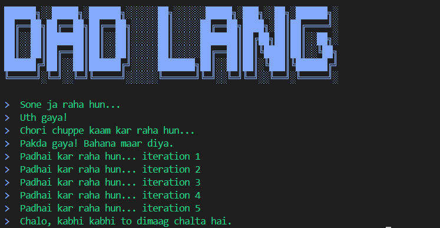

# Dad Lang 👨‍👧‍👦

**A toy programming language based on strict Indian Parents.**  
*"Kyu paida kiya tujhe?" - Compiler*
---



---

## 📦 Installation

```bash
npm i -g dad-lang
```

## 🚀 Usage

### 1. Create a file (e.g., `test.dad`)

```javascript
idhar aao
  // Variable Declaration
  ye sambhal pocketMoney = 500;
  
  // Const Declaration (Tradition)
  ye pakka tradition = "Respect Elders";
  
  // Print Statement
  bol bhai "Pocket money: " + pocketMoney;
  
  // If-Else (Discipline)
  agar bhai pocketMoney > 200 {
    bol bhai "Kharcha kam kar!";
  } nahi to bhai {
    bol bhai "Theek hai, manage kar.";
  }
wapas aa
```

### 2. Run it

```bash
dadlang test.dad
```

---

## 📖 Language Features

### **Khandaan (OOP - Classes & Inheritance)**

Create classes with strict rules!

```javascript
hi bhai
  khandaan Baap {
    sanskar(naam) {
      khud.naam = naam;
    }
    
    advice() {
      bol bhai khud.naam + " kehte hain: Padhai karo!";
    }
  }
  
  khandaan Beta ka_khoon_hai Baap {
    advice() {
      bol bhai khud.naam + " kehte hain: Thodi party bhi chalti hai!";
    }
  }
  
  ye sambhal dad = avtaar Baap("Sharma ji");
  dad.advice();  // Output: Sharma ji kehte hain: Padhai karo!
  
  ye sambhal son = avtaar Beta("Rahul");
  son.advice();  // Output: Rahul kehte hain: Thodi party bhi chalti hai!
bye bhai
```

### **Rishtedaar (Switch-Case Statements)**

Handle situations like family meetings:

```javascript
hi bhai
  ye sambhal day = "somwar";
  
  rishtedaar_aaye (day) {
    muh_dikhai "somwar": 
      bol bhai "Office jana hai";
    
    muh_dikhai "ravivaar": 
      bol bhai "Ghar pe aaram";
    
    bache_kuche: 
      bol bhai "Kaam hai bhai!";
  }
bye bhai
```

### **Hisaab (Arrays)**

Manage lists like Dad manages expenses:

```javascript
hi bhai
  ye sambhal kharche = [100, 200, 150];
  
  bol bhai "Total items: " + kharche.aukaat;  // length
  kharche.thoos_de(50);  // push
  kharche.nikal_fek();   // pop
bye bhai
```

### **Rashan Pani (Standard Library)**

Built-in functions for daily tasks:

*   `kismat()` - Random number (0-1)
*   `tol_mol(str, pattern)` - String match
*   `taarik_pe_taarik(ms)` - Sleep/delay

---

## 🎯 Full Vocabulary

| **Dad Lang**        | **JavaScript Equivalent** | **Description**               |
|---------------------|---------------------------|-------------------------------|
| `hi bhai`           | `{`                       | Program start                 |
| `bye bhai`          | `}`                       | Program end                   |
| `bol bhai`          | `console.log()`           | Print statement               |
| `ye sambhal`        | `let`                     | Variable declaration          |
| `ye pakka`          | `const`                   | Constant declaration          |
| `nalla`             | `null`                    | Null value                    |
| `sahi`              | `true`                    | Boolean true                  |
| `galat`             | `false`                   | Boolean false                 |
| `agar bhai`         | `if`                      | If statement                  |
| `nahi to bhai`      | `else if`                 | Else-if statement             |
| `warna bhai`        | `else`                    | Else statement                |
| `jab tak bhai`      | `while`                   | While loop                    |
| `bas kar bhai`      | `break`                   | Break statement               |
| `agla dekh bhai`    | `continue`                | Continue statement            |
| `khandaan`          | `class`                   | Class declaration             |
| `ka_khoon_hai`      | `extends`                 | Inheritance                   |
| `avtaar`            | `new`                     | Object instantiation          |
| `khud`              | `this`                    | This reference                |
| `sanskar`           | `constructor`             | Constructor method            |
| `rishtedaar_aaye`   | `switch`                  | Switch statement              |
| `muh_dikhai`        | `case`                    | Case label                    |
| `bache_kuche`       | `default`                 | Default case                  |
| `dheere_dheere`     | `async`                   | Async function                |
| `ruko_zara`         | `await`                   | Await expression              |

---

## 🎓 Examples

Check out the `examples/` folder:
*   `fizzbuzz.belt` - Classic FizzBuzz
*   `factorial.belt` - Recursive factorial
*   `inheritance.belt` - OOP inheritance demo

---

## 🛠️ Development

```bash
# Clone the repository
git clone https://github.com/darkphoenix2208/DAD_LANGUAGE.git

# Install dependencies
npm install

# Build packages
npm run build

# Run tests  
npm test
```

---

## 📝 License

MIT License - Copyright (c) 2026

---
